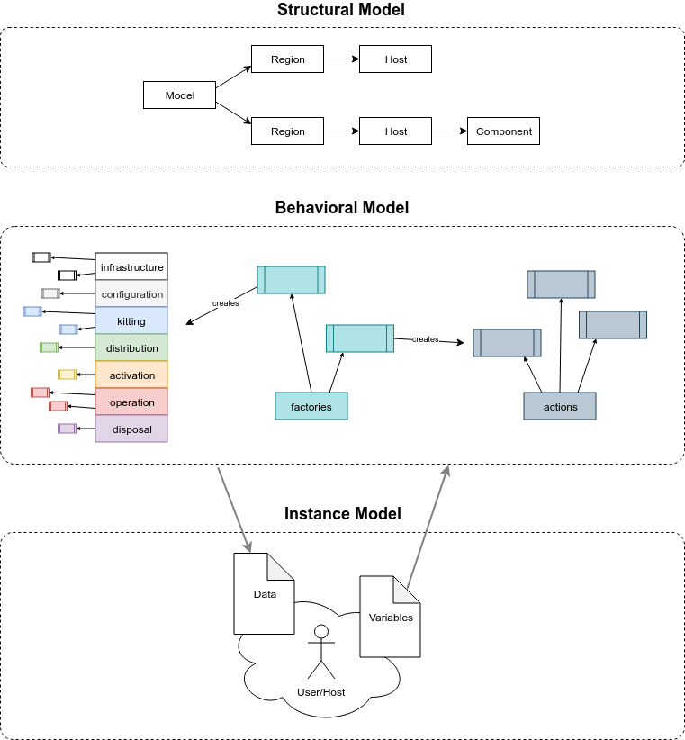

# Welcome to the Fabulous Laboratory

_(This is a work-in-progress document where sections may end randomly and abrubptly. Stay tuned)_

The Fabulous Laboratory (`fablab`) is incubating an evolved set of tooling addressing operational development concerns. These tools are being created to directly address the needs of creating, deploying, researching, and managing geo-scale Ziti networks in development and testing environments. We also foresee these tools being useful beyond our specific purpose, and finding uses in all areas of operational development.

## "As Code" as Actual Code

A great number of "as code" tools use hobbled, miserable DSLs (or they repurpose structured markup like YAML or JSON) to express their structures. These can be useful, up until the point where you need to start remotely operating and controlling these systems with any kind of complex choreography, where these DSLs break down, badly. To compensate, you might end up stringing together multiple disparate layers of tooling to assemble a [Rube Goldberg](https://en.wikipedia.org/wiki/Rube_Goldberg) contraption to meet all of your needs.

_Programmers_ solved these kinds of problems long ago with general purpose programming languages. A reasonable general purpose progamming stack is much better "glue" than trying to assemble different self-contained systems using scripts and cron jobs (even if they're disguised as microservices) to meet the entirety of your operational needs.

`fablab` is a _programming_ framework, implemented in `golang`, which seeks to support the creation of self-contained, concise, repeatable, expressive, workflow-laden operational tools. We anticipate that `fablab` will have roles across the entire operational spectrum, from conception to retirement.

`fablab` is designed to support the development and exploration of programming models for geo-scale, distributed systems.

## The Components of fablab

Like many other software tools that offer multiple degrees of freedom and extensibility, `fablab` is best described as a set of orthogonal ideas, which combine to facilitate extremely powerful, extensible software models. In order to understand the entirety of `fablab`, you'll want to make sure you understand each of the core capabilities that it provides.

Once you've grokked each of these ideas, you'll see how they can be combined to create extremely powerful tools, which dovetail seamlessly into your development environment.

### The Model

All `fablab` environments are represented by a "model" (`kernel.Model`). The model contains all of the data structures, statics, dynamically (late) bound components, and the actions (`kernel.Action`) that comprise the entirety of your distributed system.

### Model Lifecycle Stages

The model transitions through several lifecycle stages: `(creation)`, `infrastructure`, `configuration`, `kitting`, `distribution`, `activation`, `(operation)`, and `disposal`.

The model provides extension points for each of the operational stages. Strategies created for these extension points are free to bring the entirety of the language (`golang`) and runtime environment to bear on their implementation.

`fablab` provides a set of architectural primitives, which allow you to express your architectural complexity on top of its fabulous foundational patterns.

### Actions

Once the model reaches the `(operation)` "(pseudostate)", `fablab` will allow the operator to execute arbitrary `kernel.Action`s against the model. The "action" represents the primary, general-purpose extension mechanism for adding vocabulary to the operation of a `fablab` model. Once the model is `(operational)`, the actions represent the things one might want to do with the model.

### The Kernel

The `fablab` "kernel" includes all of the low-level components and concepts that the model is constructed from. It includes the software definitions of the core architectural concepts, and provides the primary extension points, as code.

The kernel provides all of the primitives, which make constructing and defining models possible. You end up with clean contractual boundaries for your components, which makes managing the _code_ for your operational tooling _dramatically_ cleaner.

The kernel includes primitives for remote puppetry using `ssh`, along with reliable, easy-to-use mechanisms for interacting with operating systems, whether local or remote. It can be extended to integrate with anything that can be controlled from code.

## Getting Started with the Examples

See the [Getting Started with the Examples](docs/examples.md) guide for details about how to get started with the stock example models.